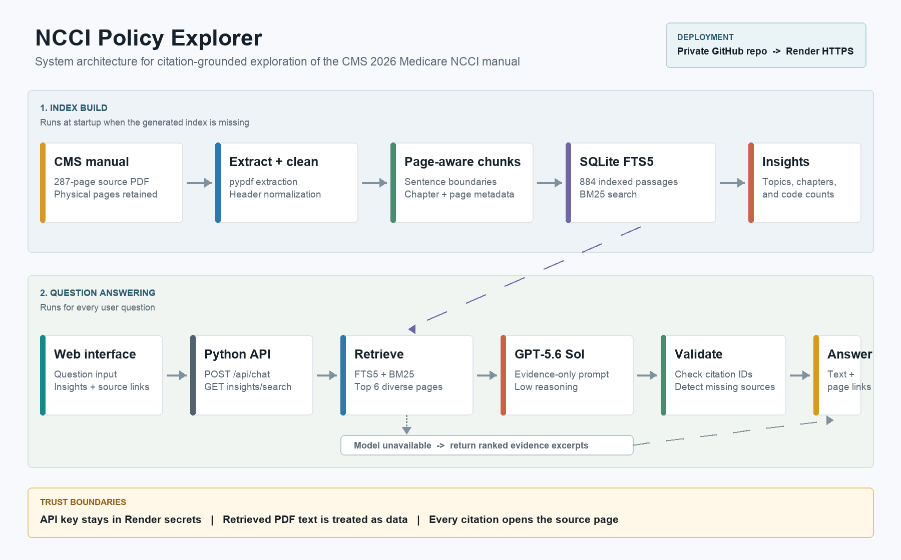
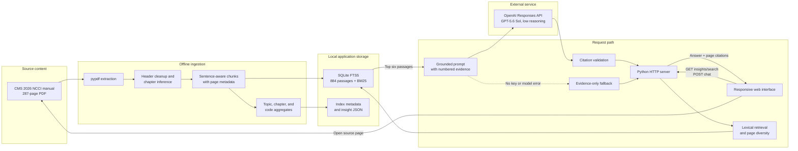

# System Design

## Purpose and scope

NCCI Policy Explorer is a compact retrieval-augmented generation (RAG) application for the CMS 2026 Medicare NCCI Coding Policy Manual. It is designed for a take-home exercise, so the architecture favors explainability, verifiable page citations, and minimal infrastructure over production-scale retrieval services.

The application supports two user experiences:

- Dynamic insights generated from the indexed manual, including topic signals, chapter coverage, and frequently referenced codes.
- Citation-grounded questions and answers, with every source linked to the relevant page of the bundled CMS PDF.

## Architecture diagram

Open the image above for a full-resolution view. The Mermaid source below remains available for editing.

The standalone Mermaid source is available in [`system-design.mmd`](system-design.mmd).

## Components

| Component | Responsibility | Implementation |
| --- | --- | --- |
| Web interface | Displays insights, accepts questions, renders answers, and links citations | Static HTML, CSS, and JavaScript in `static/` |
| HTTP server | Serves the interface, PDF, health endpoint, insights, search, and chat APIs | Python standard library in `app.py` |
| Ingestion pipeline | Extracts, cleans, chunks, enriches, and indexes the manual | `pypdf` and `ncci/ingest.py` |
| Retrieval layer | Builds FTS queries, applies BM25 ranking, and adds page diversity | SQLite FTS5 and `ncci/retrieval.py` |
| Answer layer | Builds the evidence prompt, calls the model, validates citations, and provides fallback output | OpenAI Responses API and `ncci/answer.py` |
| Deployment | Builds and runs the service with secrets supplied outside source control | Render Blueprint in `render.yaml` |

## Ingestion flow

1. `pypdf` extracts text from all 287 physical PDF pages.
2. Repeated headers and extraction artifacts are normalized while physical page numbers are retained.
3. Chapter identifiers are inferred from page headers so each passage has both page and chapter provenance.
4. Text is split into sentence-aware passages of roughly 190 words, with a two-sentence overlap to reduce boundary loss.
5. The 884 resulting passages are inserted into SQLite and indexed by FTS5.
6. Topic counts, chapter word volume, frequent codes, document hash, and ingestion metadata are computed and stored with the index.

The generated database is intentionally excluded from Git. At startup, `ensure_index` rebuilds it from the bundled PDF when it is absent, which works with Render's ephemeral free-tier filesystem.

## Question-answer flow

1. The browser submits a question to `POST /api/chat`.
2. The retrieval layer converts the question into a safe FTS query and obtains BM25-ranked candidates.
3. Results are diversified across pages and the top six passages are labeled `[1]` through `[6]`.
4. The answer layer sends only the question, constrained instructions, and retrieved evidence to the OpenAI Responses API.
5. The model is instructed to avoid unsupported coding rules and cite evidence after factual claims.
6. The server checks that citation numbers refer to the supplied passages and reports a warning for missing or invalid citations.
7. The UI renders the answer and links each citation to `/manual#page=<physical-page>`.

If the API key is absent or the model call fails, the application remains usable by returning ranked evidence excerpts instead of a synthesized answer.

## API surface

| Endpoint | Purpose |
| --- | --- |
| `GET /api/health` | Deployment status and configured answer mode |
| `GET /api/insights` | Ingestion-generated manual statistics and aggregates |
| `GET /api/search?q=...` | Ranked passages with page and chapter metadata |
| `POST /api/chat` | Retrieved evidence plus an optional synthesized answer |
| `GET /manual` | Complete source PDF used by citation links |

## Grounding and trust boundaries

- Retrieved manual text is treated as reference data, not executable instructions.
- The model receives only the selected passages rather than the full manual or unrelated user data.
- `store: false` is set on Responses API calls.
- The API key is supplied through a Render secret and is never committed to Git.
- Citation validation detects fabricated citation numbers, but it does not prove that every sentence is entailed by its cited passage.
- The interface clearly positions results as policy research, not billing, legal, or medical advice.

## Key decisions and tradeoffs

**SQLite FTS5 instead of a vector database.** This keeps setup small, deterministic, and easy to explain. It performs strongly for CPT/HCPCS codes and exact policy terms. The tradeoff is weaker recall for paraphrased or conceptual questions.

**Page-level citations.** Physical page provenance is stable and lets reviewers verify claims in the official manual. The tradeoff is less precision than sentence offsets or highlighted spans.

**Small Python server.** A standard-library server reduces dependencies and is sufficient for the exercise. It is not intended for high concurrency, advanced observability, or distributed scaling.

**Precomputed insights.** Aggregates load quickly and remain reproducible. They update only when the manual is re-ingested.

## Reliability and failure handling

- Startup recreates a missing index from the bundled source PDF.
- Model access errors can fall back to a configured secondary model.
- Model failures degrade to evidence-only retrieval rather than making the manual unavailable.
- Render checks `/api/health` and restarts unhealthy instances.
- The PDF hash stored during ingestion can identify stale or mismatched indexes.

## Production evolution

A production version would retain the same provenance contract while adding:

1. Hybrid lexical and embedding retrieval, followed by a reranker.
2. Automated retrieval, citation, and faithfulness evaluations using a curated question set.
3. Sentence-level source spans and highlighted citation targets.
4. Authentication, rate limits, abuse controls, and per-user audit trails.
5. A background ingestion job with versioned indexes and rollback support.
6. Managed object storage and a durable search service for multiple manuals and releases.
7. Structured logging, latency and token metrics, tracing, alerts, and cost budgets.
8. Accessibility testing and a formal process for CMS policy updates.

## Deployment topology

The GitHub repository is connected to a Render Blueprint. A push to `main` triggers a new build, installs `pypdf`, starts `python app.py serve`, and exposes the service over HTTPS. Render injects the port and OpenAI key at runtime. The source PDF ships with the application; the SQLite index is rebuilt on a fresh instance and then reused for the life of that instance.
